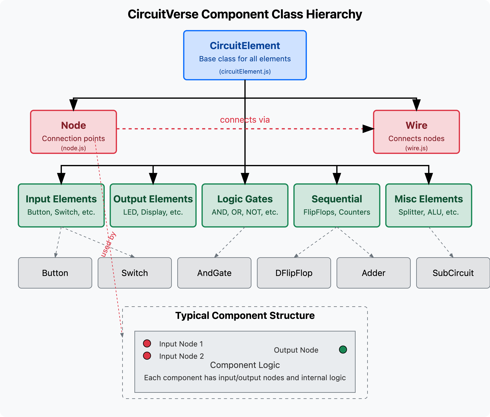
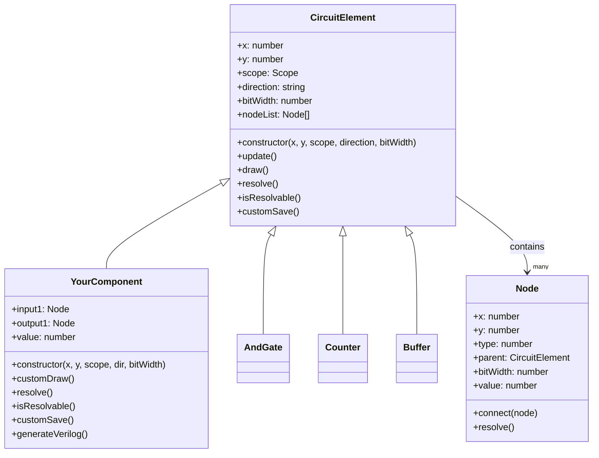
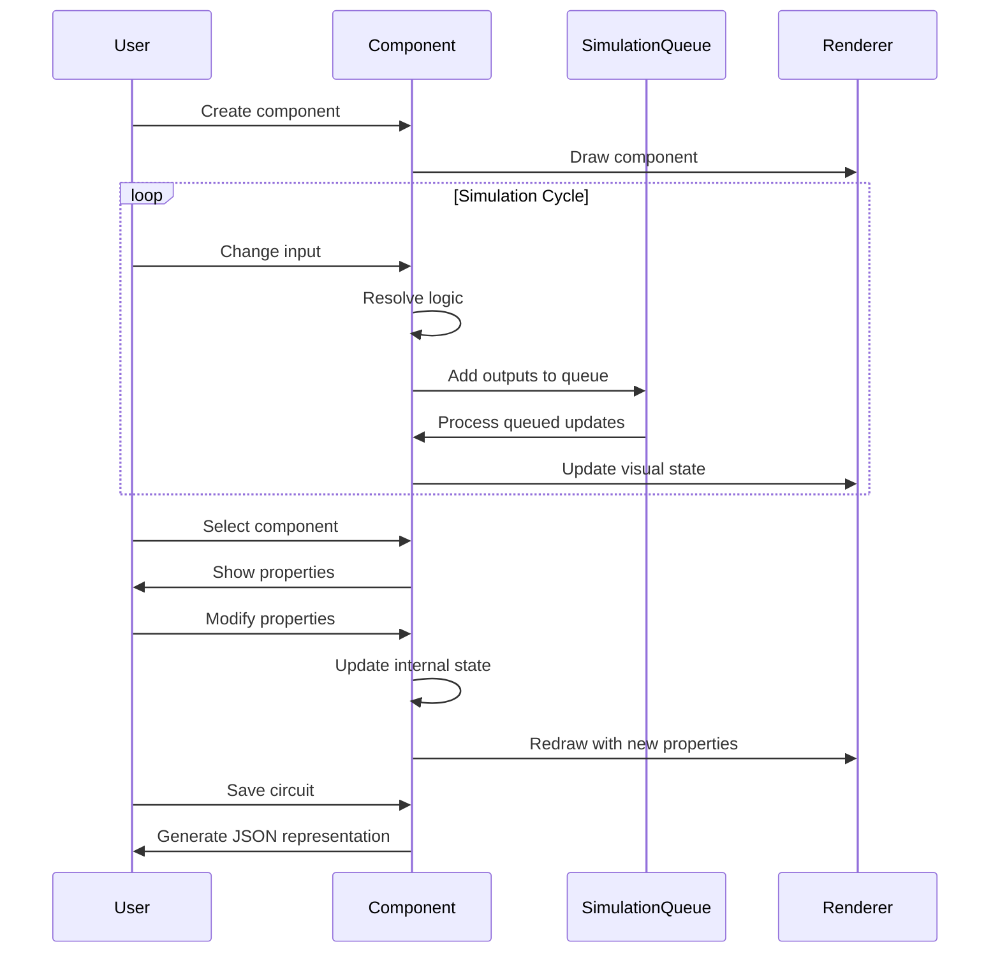

# How to Add New Elements to CircuitVerse: A Comprehensive Guide

Having explored the internal architecture of CircuitVerse, we can now proceed with a step-by-step guide to adding new elements to the simulator. This guide will walk you through the entire process, from conceptualizing your component to integrating it fully into the CircuitVerse ecosystem.



## Table of Contents

1. [Planning Your Component](#planning-your-component)
2. [Creating the Component Class](#creating-the-component-class)
3. [Implementing Core Methods](#implementing-core-methods)
4. [Adding Visual Representation](#adding-visual-representation)
5. [Handling User Interaction](#handling-user-interaction)
6. [Verilog Generation](#verilog-generation)
7. [Registration and Integration](#registration-and-integration)
8. [Testing and Debugging](#testing-and-debugging)

## Planning Your Component

Before writing any code, clearly define what your component will do:

1. **Define Behavior**: What is the purpose and function of your component?
2. **Identify Inputs/Outputs**: What signals will your component receive and produce?
3. **Determine Parameters**: What configurable properties will users be able to adjust?
4. **State Management**: Does your component need to maintain internal state?
5. **Visual Design**: How should your component appear in the circuit?

For example, if designing a Shift Register:

- **Behavior**: Shifts data bits in a specified direction on clock edge
- **Inputs**: Data input, clock, shift enable, reset
- **Outputs**: Data outputs (parallel)
- **Parameters**: Bit width, shift direction (left/right)
- **State**: Currently stored bits
- **Visual**: Rectangle with labeled I/O pins



## Creating the Component Class

Create a new JavaScript file in the `simulator/src/modules/` directory named after your component (e.g., `ShiftRegister.js`).

The basic structure follows this template:

```javascript
import CircuitElement from "../circuitElement";
import Node, { findNode } from "../node";
import simulationArea from "../simulationArea";
import { correctWidth, lineTo, moveTo, fillText } from "../canvasApi";
import { colors } from "../themer/themer";

export default class YourComponent extends CircuitElement {
  constructor(
    x,
    y,
    scope = globalScope,
    dir = "RIGHT",
    bitWidth = 1,
    ...otherParams
  ) {
    super(x, y, scope, dir, bitWidth);

    // Initialize properties
    this.setDimensions(20, 20); // width, height

    // Create input nodes
    this.input1 = new Node(-20, -10, 0, this, this.bitWidth, "Input 1");

    // Create output nodes
    this.output1 = new Node(20, 0, 1, this, this.bitWidth, "Output");

    // Initialize state variables
    this.value = 0;
  }

  // Additional methods will be implemented here...
}

// Component metadata
YourComponent.prototype.tooltipText =
  "Your Component: Description of what it does";
YourComponent.prototype.helplink = "https://docs.circuitverse.org/#/component";
YourComponent.prototype.objectType = "YourComponent";
```

## Implementing Core Methods

Every component needs to implement several key methods:

### 1. `customSave()`

This method serializes your component's state for saving:

```javascript
customSave() {
    return {
        nodes: {
            input1: findNode(this.input1),
            output1: findNode(this.output1),
            // Add all nodes
        },
        constructorParamaters: [
            this.direction,
            this.bitWidth,
            // Add other constructor parameters
        ],
        values: {
            value: this.value,
            // Add other state variables
        }
    };
}
```

### 2. `resolve()`

This method defines your component's behavior:

```javascript
resolve() {
    if (!this.isResolvable()) return;

    // Implement your component's logic here
    // Read input values, update internal state
    // Set output values

    // Example for a simple gate
    this.output1.value = this.performOperation();
    simulationArea.simulationQueue.add(this.output1);

    // Mark outputs as upstream
    this.setOutputsUpstream(true);
}
```

### 3. `isResolvable()`

This method checks if the component has enough information to compute its outputs:

```javascript
isResolvable() {
    return this.input1.value !== undefined && this.input2.value !== undefined;
}
```

### 4. `newBitWidth()`

This method handles changes to the bit width:

```javascript
newBitWidth(bitWidth) {
    this.bitWidth = bitWidth;
    this.input1.bitWidth = bitWidth;
    this.output1.bitWidth = bitWidth;
    // Update other nodes as needed
}
```

## Adding Visual Representation

The `customDraw()` method defines how your component appears:

```javascript
customDraw() {
    const ctx = simulationArea.context;
    const xx = this.x;
    const yy = this.y;

    // Draw main shape
    ctx.beginPath();
    ctx.strokeStyle = colors["stroke"];
    ctx.fillStyle = colors["fill"];
    ctx.lineWidth = correctWidth(3);

    // Example for drawing a rectangle
    rect2(ctx, -20, -20, 40, 40, xx, yy, this.direction);

    // Handle selection and hover
    if ((this.hover && !simulationArea.shiftDown) ||
        simulationArea.lastSelected === this ||
        simulationArea.multipleObjectSelections.contains(this)) {
        ctx.fillStyle = colors["hover_select"];
    }
    ctx.fill();
    ctx.stroke();

    // Add labels, indicators, or state visualization
    ctx.beginPath();
    ctx.font = "20px Raleway";
    ctx.fillStyle = colors["input_text"];
    ctx.textAlign = "center";
    fillText(ctx, this.value.toString(), xx, yy + 5);
    ctx.fill();
}
```

If your component should be visible in subcircuits, add these properties:

```javascript
YourComponent.prototype.canShowInSubcircuit = true;
YourComponent.prototype.layoutProperties = {
    rightDimensionX: 20,
    leftDimensionX: 0,
    upDimensionY: 0,
    downDimensionY: 20
};

// And implement subcircuitDraw
subcircuitDraw(xOffset = 0, yOffset = 0) {
    // Simpler drawing for subcircuit view
}
```

## Handling User Interaction

Implement interaction methods if your component needs special handling:

```javascript
// For handling double-clicks
dblclick() {
    // Open dialog, change mode, etc.
}

// For handling clicks
click() {
    // Toggle state, select option, etc.
}

// For keyboard input
keyDown(key) {
    // Handle keyboard interaction
}
```

## Verilog Generation

Add Verilog generation support:

```javascript
// For individual instance generation
generateVerilog() {
    return `assign ${this.output1.verilogLabel} = ${this.input1.verilogLabel} & ${this.input2.verilogLabel};`;
}

// For module definition (static method)
static moduleVerilog() {
    return `
module YourComponent(output out, input a, input b);
  assign out = a & b;
endmodule
`;
}
```

## Registration and Integration

### 1. Add to Module List

Edit `simulator/src/metadata.json` to add your component:

```json
"circuitElementList": [
    // Existing elements...
    "YourComponent"
],
"elementHierarchy": {
    "Sequential": [
        // Existing elements...
        {"name": "YourComponent", "label": "Your Component"}
    ]
}
```

### 2. Create SVG Icon

Create an SVG icon at `public/img/YourComponent.svg` for the component palette.

### 3. Add Documentation

Update the documentation at `docs/chapter4/` to describe your component.

## Testing and Debugging

1. **Test Functionality**: Create circuits that use your component
2. **Debug Rendering**: Check for visual glitches
3. **Test Edge Cases**: Try different bit widths, connections, etc.
4. **Verify Saving/Loading**: Ensure your component serializes correctly

Use browser dev tools to debug:

- Set breakpoints in your component methods
- Check console for errors
- Inspect component state


