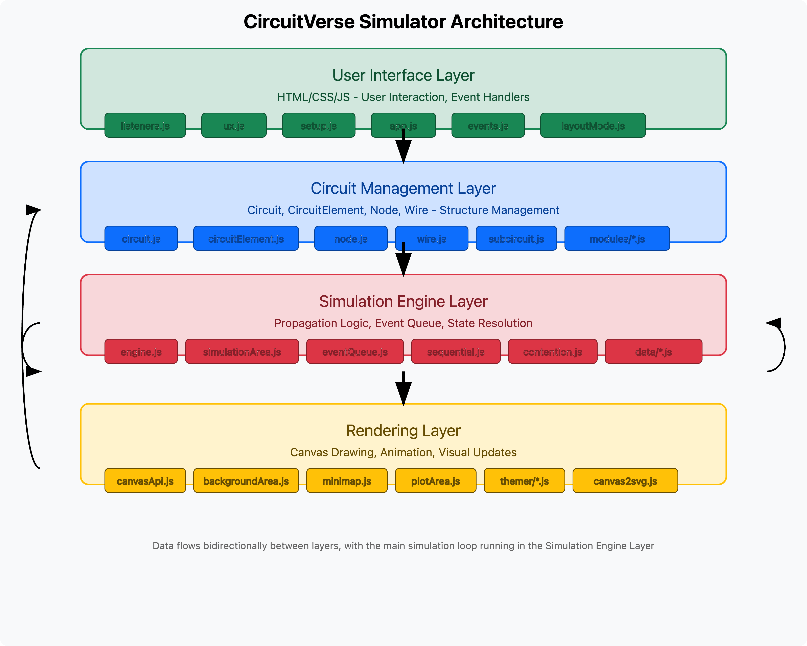
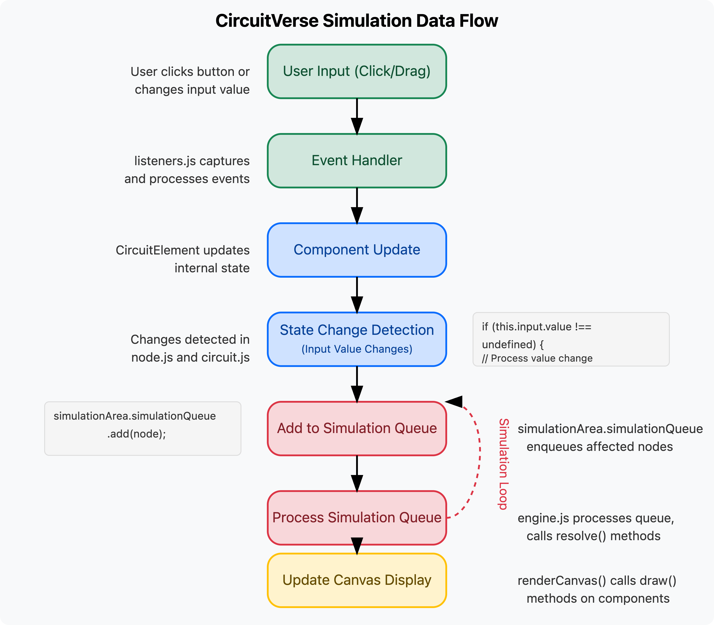
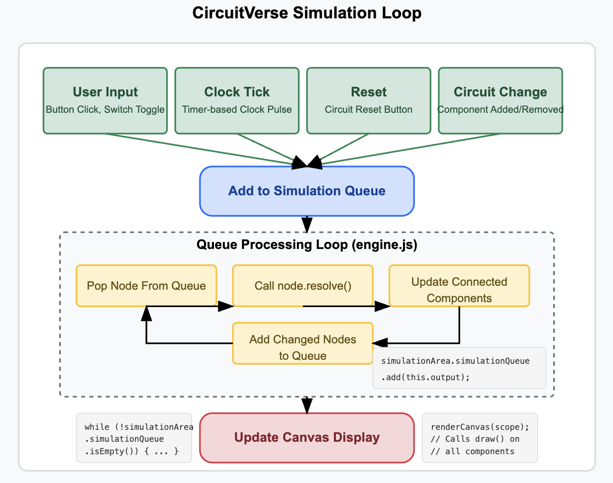

# CircuitVerse Simulator: Under the Hood

## Introduction

To effectively extend CircuitVerse with new hardware components, it's essential to first understand how the simulator works internally. This document provides a deep dive into the architecture, execution model, and component lifecycle within CircuitVerse's simulation engine.

## Core Architecture

CircuitVerse follows a modular, layered architecture with clear separation of concerns:


### Core Components:

1. **Circuit (Scope)**: Manages a collection of circuit elements
2. **Circuit Elements**: Individual components like gates, inputs, etc.
3. **Nodes**: Connection points for elements
4. **Wires**: Connections between nodes
5. **Simulation Engine**: Handles logic propagation
6. **Rendering Engine**: Draws elements on canvas

### Code Organization

The codebase is organized around these key files:

- **circuit.js**: Defines the `Scope` class that manages a circuit
- **circuitElement.js**: Base class for all circuit elements
- **node.js**: Defines nodes and connection logic
- **wire.js**: Manages connections between nodes
- **engine.js**: Core simulation and rendering logic
- **modules/*.js**: Individual circuit element types
- **simulationArea.js**: Manages the simulation canvas
- **canvasApi.js**: Drawing utilities



### 1. Circuit Representation (Scope)

The `Scope` class is the central container that represents a complete circuit:

- Each circuit has its own isolated `Scope` instance
- The scope maintains lists of all components, wires, nodes, and subcircuits
- Supports hierarchical design through `SubCircuit` elements
- Manages circuit reset, node resolution, and input tracking
- Handles serialization and deserialization for saving/loading circuits

When examining the code in `simulator/src/circuit.js`, you can see that the Scope class maintains organized collections of circuit elements:

```javascript
constructor(name = 'localScope', id = undefined) {
    this.id = id || Math.floor((Math.random() * 100000000000) + 1);
    this.CircuitElement = [];
    this.name = name;
    this.root = new CircuitElement(0, 0, this, 'RIGHT', 1);
    // ...maintaining separate arrays for different element types
    for (let i = 0; i < moduleList.length; i++) {
        this[moduleList[i]] = [];
    }
}
```

### 2. Circuit Elements (Components)

All interactive components inherit from the `CircuitElement` base class:

- Provides common lifecycle methods and properties
- Defines the interface for components to integrate with the simulation
- Handles positioning, rotation, selection, and interaction
- Manages node creation and connection

The component hierarchy is extensive, with specialized classes for:

- Input devices (Buttons, Switches, Clock)
- Logic gates (AND, OR, NOT, XOR, etc.)
- Sequential elements (Flip-flops, Registers)
- Arithmetic components (Adders, Multiplexers, etc.)
- Visual elements (Text, Labels)

Looking at various component files (like `simulator/src/modules/AndGate.js`), we can see they generally follow a consistent pattern:

```javascript
export default class AndGate extends CircuitElement {
    constructor(x, y, scope = globalScope, dir = "RIGHT", inputLength = 2, bitWidth = 1) {
        super(x, y, scope, dir, bitWidth);
        // Component setup
        this.setDimensions(15, 20);
        this.inp = [];
        this.inputSize = inputLength;
        // Node creation
        for (let i = 0; i < inputLength; i++) {
            // create input nodes
        }
        this.output1 = new Node(20, 0, 1, this);
    }
    
    // Component behavior
    resolve() {
        let result = this.inp[0].value || 0;
        for (let i = 1; i < this.inputSize; i++)
            result &= this.inp[i].value || 0;
        this.output1.value = result >>> 0;
        simulationArea.simulationQueue.add(this.output1);
    }
    
    // Visual rendering
    customDraw() {
        // Drawing logic
    }
    
    // Serialization
    customSave() {
        // Return serialized state
    }
}
```

### 3. Nodes and Wires

The connectivity model in CircuitVerse revolves around Nodes and Wires:

- **Nodes** (`Node` class) are connection points on components:
  - Input nodes (receive signals)
  - Output nodes (generate signals)
  - Each node has a bitWidth, value, and parent component
  - Nodes maintain connections to other nodes
  - Nodes can propagate values to connected nodes

- **Wires** (`Wire` class) create connections between nodes:
  - Connect two nodes bidirectionally
  - Visual representation of connections
  - Can be straight or have bends
  - Handle collision detection and convergence

Examining `simulator/src/node.js`, we see how nodes play a crucial role in signal propagation:

```javascript
resolve() {
    // For output nodes, propagate value to connected nodes
    if (this.value == undefined) {
        // Reset connected nodes if value is undefined
    } else {
        // For each connection
        for (var i = 0; i < this.connections.length; i++) {
            const node = this.connections[i];
            
            // Different handling based on node type
            switch (node.type) {
                case NODE_OUTPUT:
                    // Check for contentions
                case NODE_INPUT:
                    // Check bitwidths
                case NODE_INTERMEDIATE:
                    // Propagate value
                    if (node.value != this.value) {
                        node.value = this.value;
                        simulationArea.simulationQueue.add(node);
                    }
            }
        }
    }
}
```

## Simulation Execution Model

CircuitVerse employs an event-driven simulation model that's both efficient and accurate:



### 1. Event Queue System

The heart of the simulation is the `EventQueue` class:

- Priority queue that schedules components for updates
- Manages propagation order based on delay values
- Ensures deterministic simulation despite asynchronous UI

Looking at `simulator/src/eventQueue.js`, we see how the queue is structured:

```javascript
export default class EventQueue {
    constructor(size) {
        this.size = size;
        this.queue = new Array(size);
        this.frontIndex = 0;
        this.time = 0;
    }
    
    add(obj, delay) {
        // Add element to queue with priority
    }
    
    pop() {
        // Remove and return highest priority element
    }
}
```

### 2. Simulation Cycle


The simulation cycle follows a specific sequence:

1. **Initialization**: Reset nodes if needed
2. **Queue Seeding**: Add input elements to simulation queue
3. **Processing Loop**: 
   - Pop next node from queue
   - Resolve node (update based on inputs)
   - Add affected nodes to queue
   - Continue until queue is empty
4. **Contention Detection**: Check for signal conflicts
5. **Rendering**: Update canvas to reflect new circuit state

In `simulator/src/engine.js`, the core simulation function (`play()`) implements this logic:

```javascript
export function play(scope = globalScope, resetNodes = false) {
    // Reset if needed
    if (resetNodes || forceResetNodes) {
        scope.reset();
        simulationArea.simulationQueue.reset();
    }

    // Add inputs to queue
    scope.addInputs();
    
    // Process queue until empty
    while (!simulationArea.simulationQueue.isEmpty()) {
        elem = simulationArea.simulationQueue.pop();
        elem.resolve();
        
        // Safety check for infinite loops
        stepCount++;
        if (stepCount > 1000000) {
            showError('Simulation Stack limit exceeded');
            break;
        }
    }
    
    // Check for contentions
    if (simulationArea.contentionPending.size() > 0) {
        // Handle contentions
    }
}
```

### 3. Component Resolution

Each component type implements its own `resolve()` method that defines its behavior:

- Logic gates compute outputs based on input values
- Sequential elements may store state between cycles
- Complex components may have intricate behavior patterns

For example, from `simulator/src/modules/Adder.js`:

```javascript
resolve() {
    if (this.isResolvable() === false) {
        return;
    }
    let carryIn = this.carryIn.value;
    if (carryIn === undefined) carryIn = 0;
    const sum = this.inpA.value + this.inpB.value + carryIn;

    this.sum.value = ((sum) << (32 - this.bitWidth)) >>> (32 - this.bitWidth);
    this.carryOut.value = +((sum >>> (this.bitWidth)) !== 0);
    simulationArea.simulationQueue.add(this.carryOut);
    simulationArea.simulationQueue.add(this.sum);
}
```

## Rendering Pipeline

The visual representation of the circuit uses HTML5 Canvas:

### 1. Layered Rendering

Elements are drawn in a specific order to ensure proper layering:

```javascript
window.renderOrder = [
    ...(moduleList.slice().reverse()),  // Components (back to front)
    'wires',                           // Wires on top of components
    'allNodes'                         // Nodes on top of wires
];
```

### 2. Canvas Management

The rendering system maintains three canvas layers:

- Background canvas: Grid dots and static elements
- Simulation canvas: Circuit elements, wires, and nodes
- Minimap canvas: Small overview of the entire circuit

### 3. Component Drawing

Each component implements a `customDraw()` method:

- Uses canvas API to render shapes, lines, and text
- Handles selection and hover states
- Draws in the correct position and orientation
- May include animation or state visualization

From `simulator/src/modules/AndGate.js`:

```javascript
customDraw() {
    var ctx = simulationArea.context;
    ctx.beginPath();
    ctx.lineWidth = correctWidth(3);
    ctx.strokeStyle = colors["stroke"];
    ctx.fillStyle = colors["fill"];
    const xx = this.x;
    const yy = this.y;

    moveTo(ctx, -10, -20, xx, yy, this.direction);
    lineTo(ctx, 0, -20, xx, yy, this.direction);
    arc(ctx, 0, 0, 20, -Math.PI / 2, Math.PI / 2, xx, yy, this.direction);
    lineTo(ctx, -10, 20, xx, yy, this.direction);
    lineTo(ctx, -10, -20, xx, yy, this.direction);
    ctx.closePath();

    if (this.hover || simulationArea.lastSelected === this)
        ctx.fillStyle = colors["hover_select"];
    ctx.fill();
    ctx.stroke();
}
```

## Component Lifecycle

Understanding the complete lifecycle of a component is crucial for adding new elements:

### 1. Creation and Initialization

1. Constructor receives position, scope, direction, and bit width
2. Component creates input and output nodes
3. Initial state is set (if applicable)
4. Component is added to the scope's element collection

### 2. Interaction and Update

1. The `update()` method handles mouse interaction
2. Selection, hovering, and dragging are processed
3. Component state may change based on user interaction
4. Position and connections are updated if moved

### 3. Simulation

1. Input changes trigger additions to the simulation queue
2. Component's `resolve()` method computes new outputs
3. Output changes are propagated to connected components
4. Process continues until circuit stabilizes

### 4. Rendering

1. Canvas is cleared
2. Each visible component's `customDraw()` is called
3. Selection highlighting and hover effects are applied
4. Nodes and wires are drawn
5. Final canvas is presented to the user

### 5. Serialization

1. When circuit is saved, component's `customSave()` is called
2. Component returns object with its state and connections
3. Node references are converted to indices
4. Complete circuit is serialized to JSON

### 6. Deserialization

1. When circuit is loaded, component constructors are called
2. `customSave` data is applied to restore state
3. Node connections are re-established
4. Component is ready for simulation

## Verilog Integration

CircuitVerse also supports Verilog generation:

- Components implement `generateVerilog()` methods
- Returns Verilog code representing the component
- Enables export to hardware description languages
- Supports educational connection between simulation and HDL

## Adding New Components

To create a new component, we need to:

1. Create a new class that extends `CircuitElement`
2. Implement required methods:
   - `constructor`: Set up component structure and nodes
   - `customSave`: Serialize component state
   - `resolve`: Define component behavior
   - `customDraw`: Define visual appearance
   - `generateVerilog`: Support Verilog export
3. Register the component in the module system
4. Create an SVG icon for the component palette

This understanding of the simulator internals provides the foundation for implementing new components like shift registers and counters, as proposed for this project.

