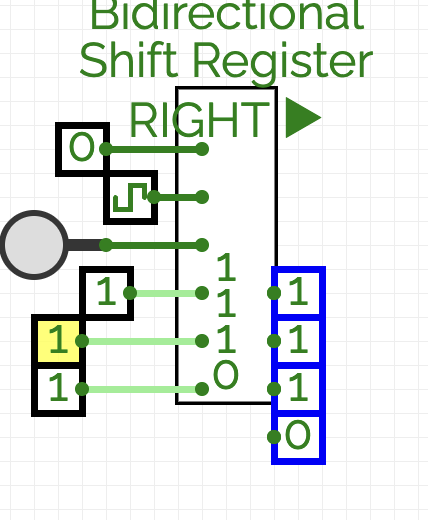

# Bidirectional Shift Register

[GitHub Link](https://github.com/Legend101Zz/CircuitVerse/blob/feat/simulator/POC/simulator/src/modules/BidirectionalShiftRegister.js)

## Overview

The Bidirectional Shift Register extends basic shift register functionality by allowing data to shift in either left (toward MSB) or right (toward LSB) direction depending on a control input. This provides more flexibility for data manipulation operations.

## Implementation Details

This CircuitVerse component builds upon the basic shift register with these features:

- **Configurable Bit Width**: Support for different register lengths (default 8 bits)
- **Direction Control**: Selectable shift direction (left or right)
- **Edge-Triggered Operation**: State changes occur only on clock edges
- **Dual Serial Inputs**: Separate inputs for left and right shifting
- **Dual Serial Outputs**: Both leftmost and rightmost bits are available
- **Visual Direction Indication**: Indicates current shift direction
- **Asynchronous Reset**: Clears all bits regardless of current mode

## Inputs and Outputs

- **Right Data In**: Serial input when shifting right (1-bit)
- **Left Data In**: Serial input when shifting left (1-bit)
- **Direction Control**: Selects shift direction (0 = right, 1 = left) (1-bit)
- **Clock**: Rising edge triggers shift operation (1-bit)
- **Reset**: Asynchronously clears all bits when high (1-bit)
- **Right Data Out**: Serial output of rightmost bit (1-bit)
- **Left Data Out**: Serial output of leftmost bit (1-bit)

## Behavior

1. When **Reset** is high, all bits in the register are cleared to zero
2. On the rising edge of the **Clock** signal:
   - If **Direction Control** is low (shift right):
     - The bit at **Right Data In** enters the leftmost position
     - All other bits shift one position to the right
     - The rightmost bit is shifted out to **Right Data Out**
   - If **Direction Control** is high (shift left):
     - The bit at **Left Data In** enters the rightmost position
     - All other bits shift one position to the left
     - The leftmost bit is shifted out to **Left Data Out**

## Example Usage

The Bidirectional Shift Register is useful for:

- Implementing arithmetic shift operations
- Data manipulation requiring movement in both directions
- Reversible data transformation
- Building more complex sequential components like barrel shifters

## Verilog Implementation

The component includes Verilog generation for proper hardware synthesis.

<!-- Add your images here -->
