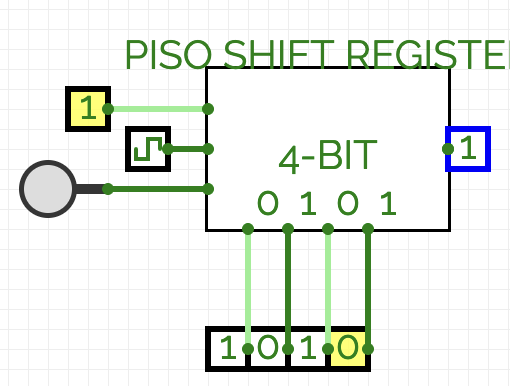

# PISO (Parallel-In Serial-Out) Shift Register

[GitHub Link](https://github.com/Legend101Zz/CircuitVerse/blob/feat/simulator/POC/simulator/src/modules/PISOShiftRegister.js)

## Overview

The Parallel-In Serial-Out (PISO) shift register allows multiple bits to be loaded simultaneously in parallel mode, and then shifted out one bit at a time in serial mode. This makes it ideal for parallel-to-serial data conversion applications.

## Implementation Details

This CircuitVerse component inherits from the `CircuitElement` base class and provides:

- **Configurable Bit Width**: Support for different register lengths (default 4 bits)
- **Dual-Mode Operation**: Can operate in either load mode or shift mode
- **Edge-Triggered Behavior**: Operates on rising edge of clock
- **Asynchronous Reset**: Resets all bits to zero regardless of current mode
- **Visual Feedback**: Shows current register contents and operating mode

## Inputs and Outputs

- **Parallel Data Inputs**: One input per bit position (n-bits)
- **Load/Shift Control**: Selects between load mode and shift mode (1-bit)
- **Clock**: Rising edge triggers operation based on current mode (1-bit)
- **Reset**: Asynchronously clears all bits when high (1-bit)
- **Serial Out**: Outputs the rightmost bit in the register (1-bit)

## Behavior

1. When **Reset** is high, all bits are cleared to zero
2. On the rising edge of the **Clock**:
   - If **Load/Shift** is high (load mode):
     - All parallel inputs are simultaneously loaded into the register
   - If **Load/Shift** is low (shift mode):
     - Bits shift one position to the right
     - A zero enters the leftmost position
     - The rightmost bit appears at the **Serial Out**

## Example Usage

The PISO shift register is commonly used for:

- Parallel-to-serial data conversion
- Implementing UART transmitters
- Memory-to-serial interfaces
- Data serialization for transmission over single-wire protocols

## Verilog Implementation

The component includes Verilog generation for hardware synthesis with appropriate module definition.

<!-- Add your images here -->
