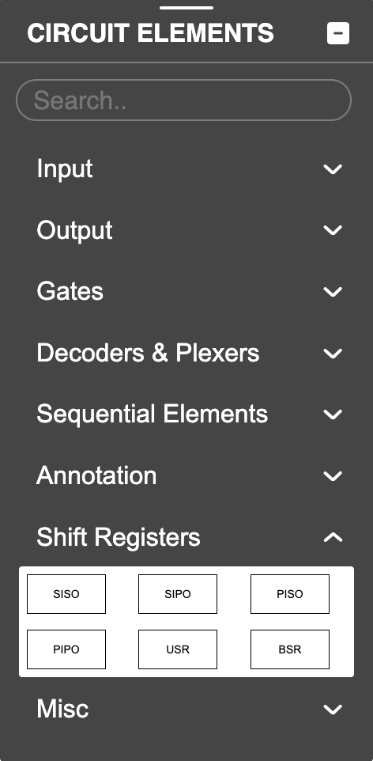
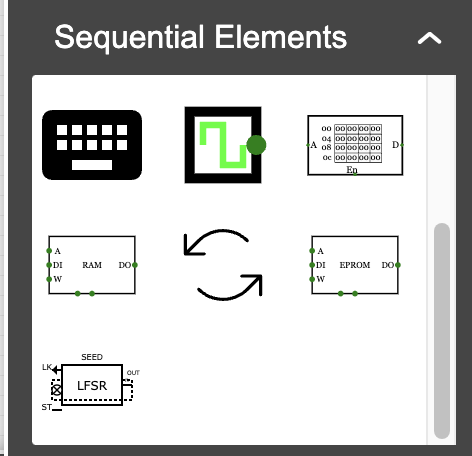

Here’s a friendlier and more personal version that clearly conveys this was part of your GSoC preparation for CircuitVerse:

---

# CircuitVerse Extensions: Sequential Logic Components

## Overview

As part of my preparation for the GSoC 2025 proposal with CircuitVerse, I created these sequential logic components as proof-of-concept implementations. The goal was to explore how new components—especially shift registers and similar elements—can be cleanly integrated into the existing CircuitVerse ecosystem. It was a fun learning experience and also helped me understand the architecture and extension workflows much better!

## Implemented Components

Each component has been built following CircuitVerse's architecture and includes key features like simulation behavior, visual rendering, serialization, and Verilog generation.

### Basic Shift Registers

| Component                           | Description                                       | Link                             |
| ----------------------------------- | ------------------------------------------------- | -------------------------------- |
| **SISO (Serial-In Serial-Out)**     | Basic shift register with serial input and output | [View Implementation](./SISO.md) |
| **SIPO (Serial-In Parallel-Out)**   | Converts serial input to parallel output          | [View Implementation](./SIPO.md) |
| **PISO (Parallel-In Serial-Out)**   | Loads data in parallel, shifts out serially       | [View Implementation](./PISO.md) |
| **PIPO (Parallel-In Parallel-Out)** | Synchronous parallel data buffer                  | [View Implementation](./PIPO.md) |

### Advanced Shift Registers

| Component                        | Description                                     | Link                                                   |
| -------------------------------- | ----------------------------------------------- | ------------------------------------------------------ |
| **Bidirectional Shift Register** | Shifts data in either left or right direction   | [View Implementation](./BidirectionalShiftRegister.md) |
| **Universal Shift Register**     | Supports hold, shift left/right, and load modes | [View Implementation](./UniversalShiftRegister.md)     |

### Specialized Counters

| Component                                 | Description                                            | Link                                    |
| ----------------------------------------- | ------------------------------------------------------ | --------------------------------------- |
| **Ring Counter**                          | Circulates a single '1' bit among register positions   | [View Implementation](./RingCounter.md) |
| **LFSR (Linear Feedback Shift Register)** | Generates pseudo-random sequences using feedback logic | [View Implementation](./LFSR.md)        |

## Implementation Status

These are still in a **proof-of-concept** stage but demonstrate that:

- The logic simulation works as expected
- Visual rendering integrates nicely into the canvas
- State can be saved/loaded (serialization works)
- Verilog generation is functional

## What’s Needed for Full Integration

To make these fully production-ready and part of CircuitVerse, the following steps would be needed:

1. Code review to align with CircuitVerse’s standards
2. SVG icons for the component toolbox
3. Complete documentation
4. Test cases and testbench integration

## Architecture Notes

All components follow the standard component pattern in CircuitVerse:

- Extend from `CircuitElement`
- Define inputs, outputs, and internal state
- React to clock edges using `resolve()`
- Implement `customDraw()` for visual behavior
- Include `customSave()` and `customLoad()` for serialization

## Demonstration

Here’s a video showing these components in action:

## Future Ideas

Some directions I’d love to explore next:

- Better Element UI/UX of elements (e.g. currently the UI is pretty crude as can be seen in the demo )
- Deeper Verilog customization
- Better integration with CircuitVerse’s unit testing

---
