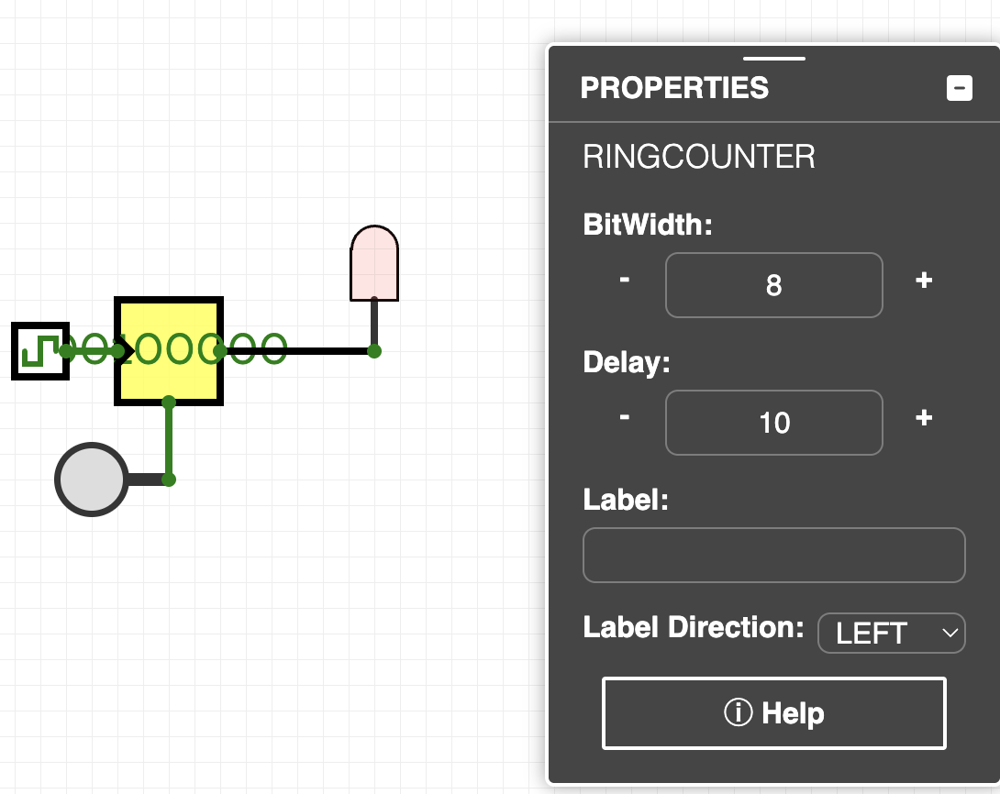

# Ring Counter

[GitHub Link](https://github.com/Legend101Zz/CircuitVerse/blob/feat/simulator/POC/simulator/src/modules/RingCounter.js)

## Overview

A Ring Counter is a special type of shift register where a single '1' bit circulates among all bit positions, with all other positions containing '0'. It creates a "ring" of shifting bits where the output of the last flip-flop is connected to the input of the first flip-flop.

## Implementation Details

This CircuitVerse component provides:

- **Configurable Bit Width**: Support for different counter lengths (default 4 bits)
- **Initialization Control**: Special preset input to establish the initial '1' bit
- **Edge-Triggered Operation**: Updates occur only on clock edges
- **Visual Position Indicator**: Clearly shows the active bit position
- **Asynchronous Reset**: Clears all bits regardless of current state
- **Automatic Correction**: Will establish a valid state even after invalid inputs

## Inputs and Outputs

- **Preset**: Initializes the counter with a single '1' at position 0 (1-bit)
- **Clock**: Rising edge triggers the shifting operation (1-bit)
- **Reset**: Asynchronously clears all bits when high (1-bit)
- **Parallel Outputs**: One output per bit position, only one is high at a time (n-bits)

## Behavior

1. When **Reset** is high, all bits in the counter are cleared to zero
2. When **Preset** is high, bit position 0 is set to '1' and all other positions to '0'
3. On the rising edge of the **Clock** signal:
   - The '1' bit shifts one position to the right
   - When the '1' bit reaches the last position, it wraps around to position 0
4. If the counter enters an invalid state (all zeros or multiple ones), the next clock pulse will attempt to correct it by setting only bit 0 to '1'

## Example Usage

The Ring Counter is commonly used for:

- Sequencing control signals
- State machines with mutually exclusive states
- Addressing elements in a circular buffer
- Timing and synchronization circuits
- Frequency division (divides by n, where n is the counter length)

## Verilog Implementation

The component includes Verilog generation for hardware synthesis.

<!-- Add your images here -->
