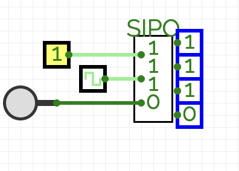

# SIPO (Serial-In Parallel-Out) Shift Register

[GitHub Link](https://github.com/Legend101Zz/CircuitVerse/blob/feat/simulator/POC/simulator/src/modules/SIPOShiftRegister.js)

## Overview

The Serial-In Parallel-Out (SIPO) shift register accepts data serially (one bit at a time) but makes all stored bits available simultaneously as parallel outputs. This makes it valuable for serial-to-parallel data conversion applications.

## Implementation Details

This implementation extends CircuitVerse's `CircuitElement` class with:

- **Configurable Bit Width**: Variable register length (default 4 bits)
- **Edge-Triggered Operation**: Updates on rising clock edge
- **Asynchronous Reset**: Clears all internal bits
- **Visual State Display**: Shows the current register contents
- **Multiple Output Nodes**: Each bit position has its own output node

## Inputs and Outputs

- **Data In**: Serial input for data bits (1-bit)
- **Clock**: Rising edge triggers shift operation (1-bit)
- **Reset**: Clears all register bits when high (1-bit)
- **Parallel Outputs**: One output node per bit position (n-bits)

## Behavior

1. When **Reset** is high, all internal bits are cleared to zero
2. On the rising edge of the **Clock** signal:
   - The bit at **Data In** enters the first position
   - All other bits shift one position to the right
3. All bits in the register are continuously available at the parallel outputs

## Example Usage

The SIPO shift register is commonly used for:

- Converting serial data to parallel format
- Capturing serial data streams for parallel processing
- Serial-to-parallel interfaces between different systems
- Data acquisition from serial sources

## Verilog Implementation

The component includes Verilog generation support that properly models the SIPO behavior for hardware synthesis.

<!-- Add your images here -->
