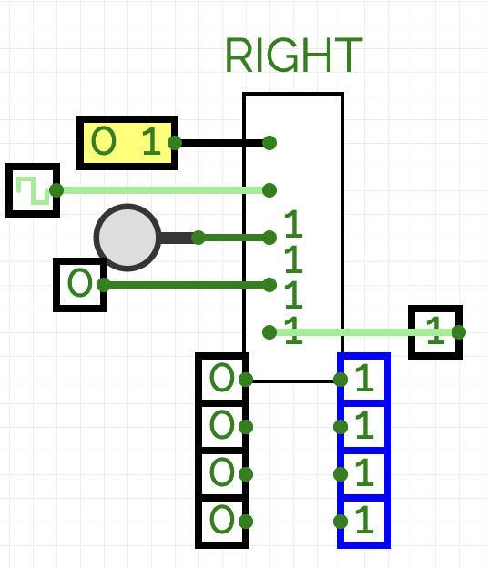

# Universal Shift Register

[GitHub Link](https://github.com/Legend101Zz/CircuitVerse/blob/feat/simulator/POC/simulator/src/modules/UniversalShiftRegister.js)

## Overview

The Universal Shift Register is the most versatile type of shift register, combining multiple operating modes in a single component. It can perform parallel loading, bidirectional shifting, and holding current value, making it suitable for a wide range of sequential logic applications.

## Implementation Details

This CircuitVerse component extends the basic shift register concept with:

- **Configurable Bit Width**: Support for different register sizes (default 8 bits)
- **Multiple Operating Modes**: Four distinct operations based on mode select
- **Complete I/O Interface**: Both parallel and serial inputs/outputs
- **Edge-Triggered Behavior**: State changes occur only on clock edges
- **Visual Mode Indication**: Displays current operating mode
- **Asynchronous Reset**: Resets all bits regardless of current mode

## Inputs and Outputs

- **Parallel Data Inputs**: One input per bit position (n-bits)
- **Serial Right Input**: Serial input when shifting right (1-bit)
- **Serial Left Input**: Serial input when shifting left (1-bit)
- **Mode Select**: 2-bit control for operating mode (2-bits)
- **Clock**: Rising edge triggers operation based on current mode (1-bit)
- **Reset**: Asynchronously clears all bits when high (1-bit)
- **Parallel Data Outputs**: One output per bit position (n-bits)

## Operating Modes

The 2-bit **Mode Select** input determines the register's behavior:

1. **00: Hold** - Maintains current register value (no change)
2. **01: Shift Right** - Shifts all bits one position right, new bit from Serial Right Input
3. **10: Shift Left** - Shifts all bits one position left, new bit from Serial Left Input
4. **11: Parallel Load** - Loads all Parallel Data Inputs simultaneously

## Behavior

1. When **Reset** is high, all bits in the register are cleared to zero
2. On the rising edge of the **Clock** signal:
   - The operation is determined by the **Mode Select** value as described above
3. All bits in the register are continuously available at the parallel outputs

## Example Usage

The Universal Shift Register is ideal for:

- Programmable data manipulation
- Complex sequential operations
- Arithmetic shift operations
- Register files with multiple access modes
- Versatile data buffering with flexible I/O options

## Verilog Implementation

The component includes comprehensive Verilog generation for hardware synthesis.
