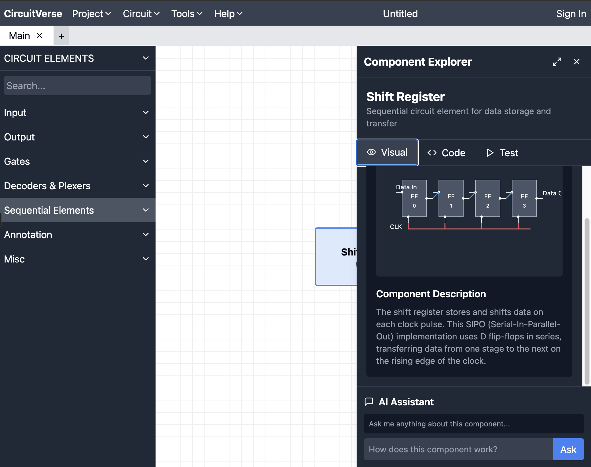
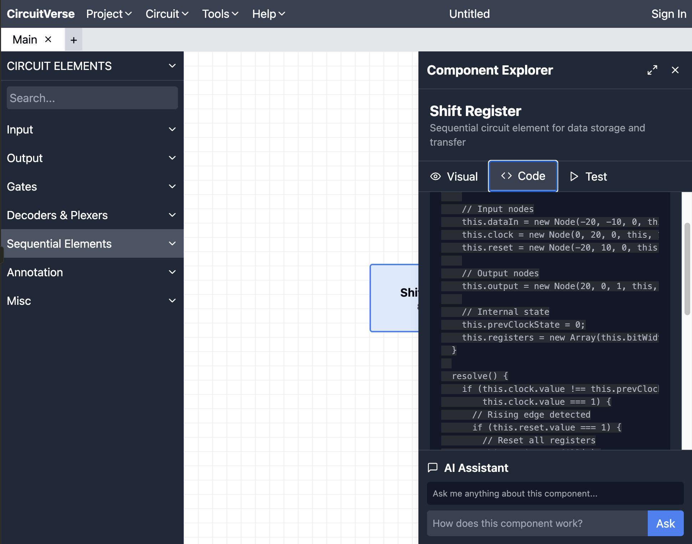
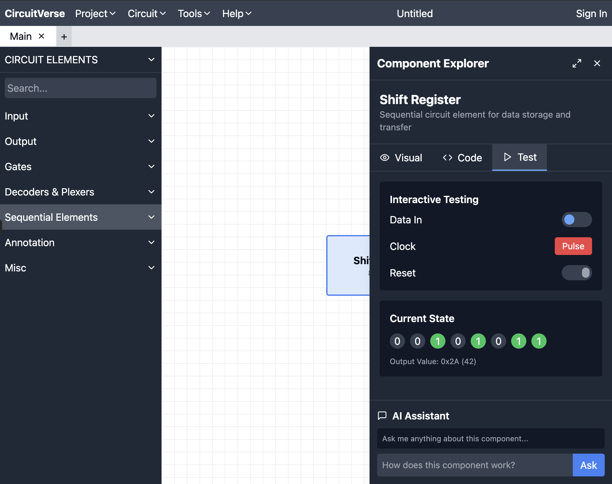
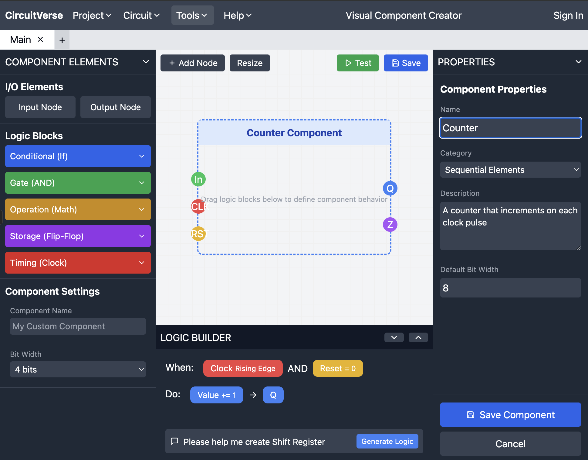

# Looking Ahead: Enriching CircuitVerse with Interactive Learning Tools

After implementing the Shift Register components, I've been thinking about how we could take CircuitVerse to the next level as an educational platform. Here are two feature ideas I'm particularly excited about:

## Component Explorer: Demystifying Digital Circuits

Many students use CircuitVerse components as "black boxes" without understanding what's happening inside. What if we could let users peek inside these components and learn from them?

The Component Explorer would:

- Allow students to "open up" any component to see its internal implementation
- Show both the visual circuit representation and the underlying code
- Include an interactive testing area where users could see how signals flow through the component
- Create a natural learning progression from using components to understanding their design

This bridges the gap between using pre-built components and creating your own, which is often a challenging leap for students.

I coded some react code to show how'd it would look :

  
  
   
  

## Visual Component Creator: Circuit Design for Everyone

Currently, creating new components requires JavaScript knowledge, which limits who can contribute. A visual component creator would:

- Empower users without programming experience to create custom components
- Use an intuitive drag-and-drop interface similar to the main CircuitVerse experience
- Include a block-based logic builder (similar to Scratch) for defining behavior
- Feature a built-in testing environment to validate component functionality

This would dramatically expand who can create and share custom components in the CircuitVerse community.

I coded some react code to show how'd it would look :

## AI Integration Opportunities

As AI and large language models continue to advance, we could enhance both tools with intelligent features:

For the Component Explorer:

- Enable natural language queries where students can ask "How does this shift register work?" and receive tailored explanations
- Generate interactive examples that demonstrate specific component behaviors based on user questions
- Provide conceptual connections between different components (e.g., "This is similar to the D Flip-Flop you used earlier because...")
- Create personalized learning paths based on a student's questions and interaction patterns

For the Visual Component Creator:

- Implement AI assistants that help users translate their ideas into functional components
- Allow users to describe desired behavior in plain language and have the system generate the appropriate visual logic
- Provide intelligent suggestions for optimizing component designs
- Automatically detect and help fix logical errors in custom component designs

These AI-powered enhancements would make CircuitVerse more accessible and educational, helping bridge the gap between using pre-built components and understanding digital logic at a deeper level.

## Implementation Path

I've explored both ideas at a conceptual level and believe they're feasible additions to CircuitVerse. The work I've done on the Shift Register components has given me valuable insights into CircuitVerse's architecture that would help with implementation.

For the Component Explorer, we could start by extracting and displaying the existing component code, then gradually add more interactive features. For the Visual Component Creator, we'd need to define a component data model and build the visual editor interface.

As AI capabilities continue to evolve, we could even integrate AI assistance into both tools—helping users understand component behavior or suggesting improvements to custom designs.

These enhancements would transform CircuitVerse from a circuit simulator into a comprehensive learning platform that guides users all the way from using components to understanding them to creating their own.
